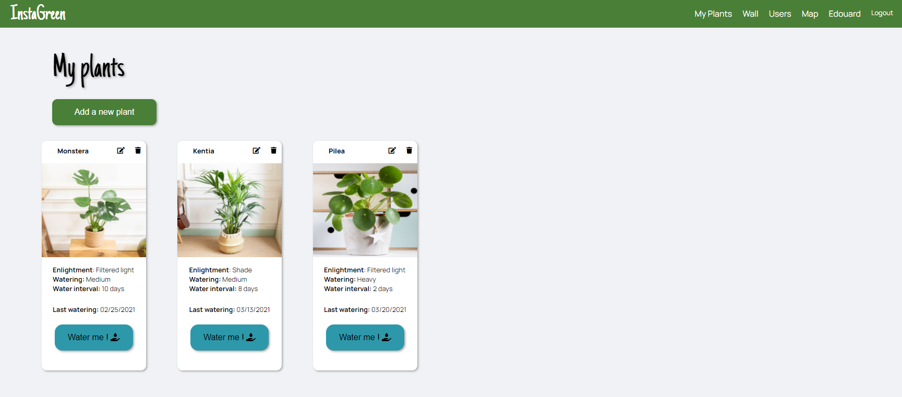

# Instagreen

> Mini social app about plants; share pictures with others and follow up your plant watering.

## Table of contents

- [General info](#general-info)
- [Screenshots](#screenshots)
- [Technologies](#technologies)
- [Setup](#setup)
- [Features](#features)
- [Status](#status)
- [Contact](#contact)

## General info

This is my first React App done for the final project at my IronHack Bootcamp;
It uses "vanilla" react with class components mostly;

## Screenshots

## Technologies

- React - version 16.13.1
- Axios - version 0.19.2
- Cloudinary - version 1.23.0

## Setup

- $npm i
- create .env REACT_APP_BACKEND_URL = http://localhost:XXXX
- $npm start

## Features

List of features ready and TODOs for future development

- Wall with posts and comments
- Instagram / facebook inspired look
- Plant update for watering

To-do list:

- Friend system
- Responsive design for mobile

## Status

Project is: _in progress_

## Contact

Created by [@lepfau](https://www.github.com/lepfau) - feel free to contact me!
